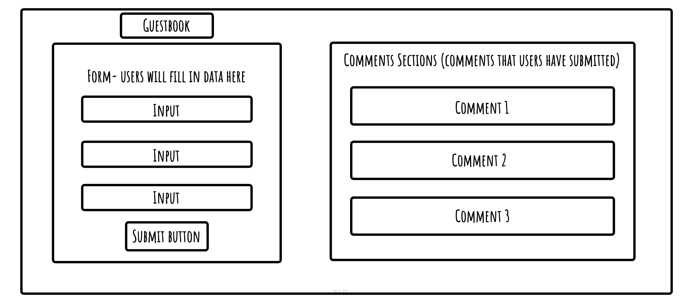

This is my wireframe on how I wanted my guestbook to roughly look 

This is my Trello board

Required
🎯 What requirements did you achieve?
- I was able to ensure that my HTML form was working and submitting data into the database as expected
- My project was functional on an mobilw screen size using media queries
- I was able to create a working GET API route in your server and a working POST API route in your client.
- I seeded my database with realistic-looking ‘dummy’ data through a seed file from my server. I prefer using a seed file because then I can view all my queries in one place such as on VSCode. Also it helps me with understanding the SQL syntax. 

🎯 Were there any requirements or goals that you were unable to achieve?
- I would like to know how to dynamically display the data submitted in the from from the GET route in my client folder. To display the data the user has submitted in the form, they would need to refresh the page. However for better user experience it would be nice for them to see their comment straight away,therefore please could you show me a way to display it dynamically 🙏

🎯 If so, what was it that you found difficult about these tasks?
The part that I got stuck on was trying to send the data from the server to the database. On line 46 in server.js I originally wrote `data.name` assuming that having the `name` property was enough to link it to the data from the body. However after speaking to Manny he suggested that `formValues` would be needed because it encapsulates all the form inputs as an object and then you would access the indivdual field such as name, origin... Therefore you would write it as `data.formValues.name`.
Also I tried to dynamically display the data after submitting the data but couldn't work it out so I left that out. 

What useful external sources helped you complete the assignment (e.g Youtube tutorials)?
I used our class demos and workshops to help me complete the assignment as a lot of it was very similar to what we had to do in this project. I used W3Schools to help me with the layout of the forms, forEach loop, SQL queries and ChatGPT to understand some definitions:
https://www.w3schools.com/html/html_forms.asp
https://www.w3schools.com/html/html_form_attributes.asp
https://www.w3schools.com/html/html_form_input_types.asp
https://www.w3schools.com/tags/tag_textarea.asp
https://www.w3schools.com/jsref/jsref_foreach.asp
https://www.w3schools.com/sql/sql_delete.asp
https://www.youtube.com/watch?v=1UsllDMhvN4&ab_channel=dcode
I also used this video and resources to help me with an alert message for when the form is submitted using the setTimeout function
https://www.youtube.com/watch?v=shWr5DNVeCI&ab_channel=BroCode
https://www.w3schools.com/jsreF/met_win_alert.asp

What errors or bugs did you encounter while completing your assignment? How did you solve them?
Sometimes my SQL queries would come up with an error because I got the syntax error. Also when trying to send data from the server to the database I got a few bugs but got some help from Manny. I had some bugs during the forEach loop but after some trial and error and checking my previous projects I was able to fix it. When trying to display the data dynamically I inserted a lot of data into the form to see if it would be shown on the webpage or not, therefore in my table I had a lot of dummy data and the ID's went over 70, however I deleted all the test data and kept the realistic data. 

What went really well and what could have gone better?
I like how I was able to make a fullstack app. I enjoyed how I started to see how everything connected with each other such as the client to the server and server to db and vice versa. I think if I knew how to display the data from the form dynamically that would've made my app better. 

## Update:
- As Supabase pauses projects after 90 days I had to create a new project and database again as I want this to be deployed so I can access it again. 
- Whilst sorting this out, I thought why not fix one of the issues I had, which was displaying the comments dynamically.
    - So I did this and with some help with Claude, I made a function that created a comment `createComment` (I more or less copied everything from the `viewGuestbook` function to a new function that just focused on creating a new comment div).
    - Then in the `handleSubmitGuestbookForm` function I created an object that creates a new comment based of the form values
    - I pass the new comment object into the `createComment` function which I assign as a variable. 
        - This is basically creating a new comment element when the user submits their comment in the form. 
    - As I would like that comment to appear at the top (newest to oldest comments), I use `insertBefore`, which appends the new comment element to the top in the `commentsContainer` div. 
    - I added a `guestbookForm.reset();` which clears the form when a comment has been submitted and added an alert after so the user knows it has been successful. 
    - I also put all of this in a try, catch block (I do want to get used to adding this in my code).
    - The `viewGuestbook` function only focuses on displaying the data and the `forEach` loop goes through each comment and passes the comment in the `createComment` function. 
        - This is creating the comment (creating the element, adding text etc)
    - This is stored as a variable and that `commentElement` variable is appended to the `commentsContainer`, it does this one by one for each comment. 
- I could've added PUT or DELETE requests but I wanted to apply these request to my other projects. 